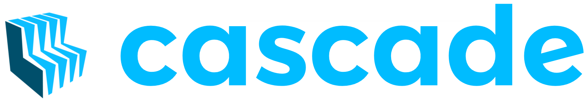

Introduction
############

Cascade is a web-based utility enabling requirements management in Microsoft Word files. Its primary design goal is to provide an efficient and rapid turn-around time for requirement document update/publish cycles.

Cascade requirements documents are authored using Microsoft Word.  Requirement meta-data (such as requirement id, test verification method, etc.) is stored within those documents in the form of "Cascade Directives", which are human readable / maintainable text (in a Cascade-specific syntax).  Because Cascade Directives are just text, Cascade requirements documents are just regular Microsoft Word documents, which means they can be shared, edited, revised, printed, and published by anyone running Microsoft Word.

Authoring, revising, publishing, and viewing Cascade documents requires no special software or plugins.  When a Cascade operation (such as requirements ID annotation, document check, or requirements export) needs to be preformed, that operation is achieved by running the Cascade utility on the MS Word file.

Some Cascade directives are written using hidden text (so that they do not appear when a document is printed).  To toggle visibility of hidden text, click the "Show/Hide ¶" button in MS Word.   By convention, hidden Cascade directives are styled with the (custom) "Cascade Hidden Directive" style, which appears orange (when made visible using "Show/Hide ¶").

Why Cascade Exists
******************
In my past, I've used two different requirements management tools: Seapine Software's TestTrack (now "Helix" from "Perforce") and IBM's DOORs. Both products suffered from a common set of problems:

- IT / Software Update issues would disrupt people's ability to work.
- Licensing issues would limit access to authoring tools.
- Publishing was time consuming, requiring an iterative edit/compile (render)/review/repeat cycle.
- The tools did not provide efficient mechanisms to export/parse document metadata (for use in analysis, tracking, etc.)
- The tools were bloated.  DOORs in particular incurred a huge tool/documentation complexity burden in order so to support my company's (fairly simple) use case.

What Cascade Does
*****************

Cascade solves the problems above by moving the metadata *inside* MS Word documents, and implementing a set of relatively lightweight utilities which parse / annotate Cascade compliant MS Word docs.  In many cases, Cascade compliant MS Word documents can be revised and published without even needing to execute the Cascade utility.

How Cascade Works
*****************

Most Cascade operations (e.g. :ref:`annotate` ) take a Cascade compliant MS Word document, modify it, and produce a new Cascade compliant MS Word document.  Some operations (e.g.  :ref:`aggregate`) produce a new document of a different type (such as an Excel spreadsheet), and some (e.g. "Check") produce no output document.

To run a Cascade operation on a document:

- Select the appropriate operation from Cascade's "Utilities" menu.
- Specify the document(s) to upload
- Click "Run"
- View the result log
- (If the operation was successful) Download the resulting output file.

Quick Start
***********

The quickest way to get started when Authoring a Cascade document is to:

- Download the (TBD example document) from the "Downloads" menu.
- Click "Show/Hide ¶" to show hidden text.
- Edit the value of the ``"prefix"`` attribute in the ``#document_info`` directive to match your document (Note: The prefix must end in a "-")
- There are examples of ``#shortform`` requirement directives in the "General" section.  Every requirement you write should begin with a ``#shortform`` directive.  The directive declares the id (requirement number), verification method, and (if they exist) requirements satisfied by the new requirement.

  - The id should match the prefix you declared in the ``#document_info`` directive, and should end in a "-?".  The question mark indicates that a number has not yet been assigned to the requirement.  Later, when you have finished authoring most of your requirements, you will use Cascade's  :ref:`annotate` command to automatically replace the "-?" suffixes with numbers.  For example "ERD-XYZ-?" might become "ERD-XYZ-0001" after annotation.

Where Cascade Lives
*******************

- Cascade is a web application. A publicly accessible version is maintained at: Cascade_
- Cascade is open source.  If you want to host your own version on a private server (or locally on your machine) you can obtain it from GitHub at: `Cascade Git Repo`_

Cascade's Design Philosophy
***************************

**The Zen of Cascade:**

- **Compilation is evil**

  - Authoring a requirements document should not require a "compile" operation.

- **One answer is better than two**

  - Requirements and their associated metadata should reside in a single document.

- **The future is uncertain**

  - The metadata representation should be extensible, so that new fields can be arbitrarily added without breaking existing tools.

- **Parsing is powerful**

  - Metadata should be parseable, so that other utilities and organizations can gather and relate metadata from Cascade documents.

- **Common tasks should be the easiest**

  - Metadata should be readable and maintainable by humans.
  - Publishing should be quick and easy.
  - Infrastructure issues (network, tools, licenses) should not prevent you from getting work done.

  .. _Cascade: https://cascaderequirements.com
  .. _Cascade Git Repo: https://github.com/epmoyer/cascade/